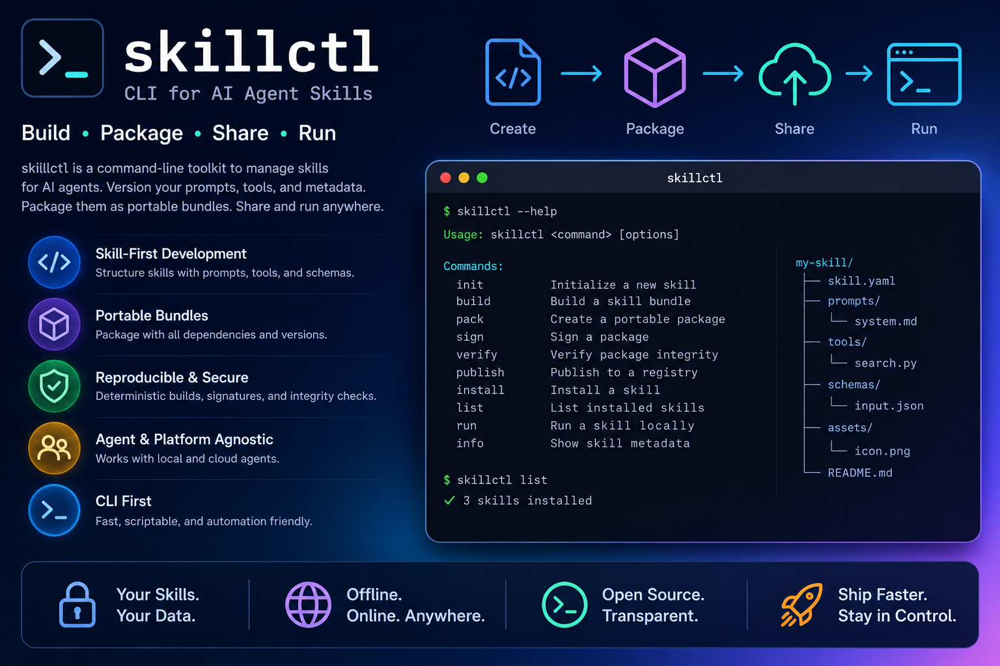

<div align="center">

# m3c-tools

### Give your agents a memory, and proof of what they're allowed to do.

**Multi-Modal-Memory Tools** is a personal, sovereign toolkit for turning everything you
see, hear and decide into durable, structured memory, and for governing the agent skills
that act on it. Two command-line tools, one repository, zero mandatory cloud middleman.

[](https://github.com/kamir/m3c-tools/actions/workflows/ci.yml)
[](https://github.com/kamir/m3c-tools/releases/latest)
[](#install)
[](https://go.dev)
[](https://goreportcard.com/report/github.com/kamir/m3c-tools)
[](https://slsa.dev)
[](LICENSE)

[Quickstart: m3c-tools](docs/quickstart-m3c-tools.md) ·
[Quickstart: skillctl](docs/quickstart-skillctl.md) ·
[Full manuals](#-documentation) ·
[Website](https://kamir.github.io/m3c-tools)

<br>



</div>

---

## Why this exists

Autonomous agents need two things you can't buy off the shelf:

1. **A memory of what actually happened**: not a chat log, but structured, multimodal,
   replayable observations that live on infrastructure *you* control.
2. **Proof of what they're allowed to do**. Every skill an agent runs should carry a
   verifiable identity, be revocable on demand, and be checkable **offline**, with no
   external authority in the verification path.

This repository ships one focused tool for each half.

| Tool | The one-liner | You use it to… |
|------|---------------|----------------|
| **`m3c-tools`** | *The capture pipeline.* | Turn YouTube videos, audio, screenshots and voice notes into multimodal memory on your own [ER1](https://er1.io) knowledge server. |
| **`skillctl`** | *The capability plane.* | Sign, admit, verify and revoke the agent skills that read that memory and act, so nothing runs unless it's authorized and provable. |

`m3c-tools` fills the memory. `skillctl` governs the hands. Together they're the
personal-scale foundation for running agents you can actually trust in production.

---

## 60-second start

Pick the tool you came for. Both ship as single static binaries in every
[release](https://github.com/kamir/m3c-tools/releases/latest).

### `m3c-tools`: capture your first memory

```bash
# macOS (Apple Silicon): see Install below for Intel / Linux / Windows
curl -sL https://github.com/kamir/m3c-tools/releases/latest/download/m3c-tools-darwin-arm64.tar.gz | tar xz \
  && sudo mv m3c-tools-darwin-arm64 /usr/local/bin/m3c-tools

m3c-tools setup                         # guided onboarding (ER1 URL, login, key)
m3c-tools transcript dQw4w9WgXcQ        # fetch a YouTube transcript, right now
m3c-tools doctor                        # verify connectivity & config
```

→ **Full walkthrough:** [Quickstart: m3c-tools](docs/quickstart-m3c-tools.md)

### `skillctl`: sign and verify your first skill

```bash
# macOS / Linux / Windows, signed installer: fetches the right binary from the
# signed skillctl/v* release and verifies cosign/OIDC provenance + SHA-256 first.
curl -fsSL https://raw.githubusercontent.com/kamir/m3c-tools/f43eb496685a9f9cbc5b9a28046f568e70ee7dd9/tools/skillctl-install.sh | bash

skillctl keygen --out ~/.config/m3c/skill-keys/mykey            # ed25519 → mykey.priv + mykey.pub
skillctl pack --skill ./my-skill -o my-skill.skb --name my-skill --version 1.0.0
skillctl sign --key ~/.config/m3c/skill-keys/mykey.priv my-skill.skb
skillctl verify-sig --pubkey ~/.config/m3c/skill-keys/mykey.pub my-skill.skb   # offline, no server
```

→ **Full walkthrough:** [Quickstart: skillctl](docs/quickstart-skillctl.md)

---

## What `m3c-tools` captures

Four capture channels flow through one shared pipeline:

```
Capture → Preview + Record → Whisper transcribe → Tag editor → Store to ER1
```

| Channel | Trigger | What it captures |
|---------|---------|------------------|
| **A: YouTube** | Paste a video URL/ID | Transcript + thumbnail + your voice comment |
| **B: Screenshot** | Menu item | Screenshot + voice note (uses clipboard image if present) |
| **C: Impulse** | Menu item | Interactive region capture + quick voice note |
| **D: Audio Import** | Menu item / CLI | Batch audio from a folder (e.g. a voice recorder or Plaud/Pocket sync) |

Each observation becomes a multimodal ER1 document: text + audio + image, with tags and
metadata. On macOS this is a native menu-bar app; on Linux/Windows it's a full CLI.
Even without a transcript (e.g. subtitles disabled), a YouTube capture still keeps the
thumbnail and the source link: the observation lands regardless.

**Field recordings, positioned in real time.** `m3c-tools plaud` drains your Plaud.ai
recordings, customer visits (*Kundenbesuche*), meetings and field notes, straight into
ER1, and `m3c-tools pocket` does the same for a Pocket device. Synced items are placed at
their **true recording time**, not the moment you synced them (`plaud fix-times` backfills
earlier imports), so captures from multiple devices land on the timeline where they
actually happened. On **macOS**, `plaud dev` uses the official auto-refreshing OAuth token
(no daily re-login) and, by default, leaves un-transcribed audio to **server-side**
transcription: see [Setup & Operations](docs/setup-target-devices.md).

**Command surface:** `transcript`, `upload`, `whisper`, `thumbnail`, `record`, `screenshot`,
`import-audio` (capture); `plaud` (`list` · `check` · `sync` · `fix-times` · `auth`; macOS `dev list/sync/status`) and
`pocket` (field-recording sync); `retry`, `cancel`, `schedule`, `status` (ER1 queue);
`doctor`, `check-er1`, `config` (incl. `doctor`), `settings`, `token`, `devices`, `login`,
`setup`, `menubar` (setup & diagnostics). See the [m3c-tools manual](docs/manual-m3c-tools.md).

## What `skillctl` governs

`skillctl` is the trust-and-governance CLI for agent skills. It implements a full lifecycle
so a skill can be trusted end to end:

```
author → pack → sign → admit → attest → verify / install → use → audit → revoke
```

- **Offline-verifiable.** The trust-chain check needs no hosted CA in the verification path.
- **Revocable on demand.** Signed, offline revocation lists; freshness contracts, fail-closed.
- **Provable identity for agents.** `agentid` issues owner-signed mandates that verify offline.
- **Auditable.** A local transparency log (`translog`) and a Claude Code trust gate
  (`verify-hook`) that fails closed.

**Command surface**: *authoring:* `keygen`, `pack`, `sign`, `verify-sig`; *trust & install:*
`trust`, `install`, `verify`, `verify-hook`; *governance:* `attest`, `revoke`, `agentid`,
`publish`, `pull`, `registry`; *audit & transparency:* `audit`, `seal`, `scan`, `review`,
`propose`, `translog`, `gate-stats`; plus `project`, `session`.
See the [skillctl manual](docs/manual-skillctl.md).

---

## 📚 Documentation

| Page | For |
|------|-----|
| [**Quickstart: m3c-tools**](docs/quickstart-m3c-tools.md) | Capture your first memory in 5 minutes |
| [**Quickstart: skillctl**](docs/quickstart-skillctl.md) | Sign, install and verify a skill in 5 minutes |
| [**Quickstart: skillctl-demo**](docs/quickstart-skillctl-demo.md) | Run the skill-trust scenarios offline on your own machine, 3 run live with real exit codes (S1/S2A/S5); the remaining panels render their story but run nothing (S3 is a built-but-not-run PARTIAL, S2BC/S4 are ROADMAP), plus hands-on Kata training (shipped): five Katas, each beat a real skillctl exit code (K5 demonstrates the offline revocation deny live) |
| [**Manual: m3c-tools**](docs/manual-m3c-tools.md) | Every command, flag and config variable |
| [**Manual: skillctl**](docs/manual-skillctl.md) | The full trust lifecycle, command by command |
| [Menu Bar App](docs/menubar-app.md) | Channels, Observation Window, menu items (macOS) |
| [Setup & Operations: Intel Mac & Windows](docs/setup-target-devices.md) | Zero-to-operating runbook for fresh Intel Mac / Windows target devices |
| [Platform differences](docs/PLATFORM-DIFFERENCES.md) | What works where |
| [Website](https://kamir.github.io/m3c-tools) | The rendered docs site |

---

## Install

Both binaries are attached to every [release](https://github.com/kamir/m3c-tools/releases/latest).
Swap `m3c-tools` ↔ `skillctl` in any one-liner below to install the other tool.

The **scripted one-liners** fetch the right binary for your host, **verify cosign provenance
(GitHub OIDC) + the SHA-256 digest**, then install **user-scoped**: no admin rights:

**Windows (PowerShell):**
```powershell
irm https://raw.githubusercontent.com/kamir/m3c-tools/f43eb496685a9f9cbc5b9a28046f568e70ee7dd9/tools/skillctl-install.ps1 | iex
```

Installs `skillctl` to `%LOCALAPPDATA%\Programs\skillctl` after verifying cosign provenance +
SHA-256. Override with `$env:INSTALL_DIR` / `$env:RELEASE_BASE`. This is the **light,
user-scoped, no-admin** path: distinct from the machine-wide `M3C-Tools-Setup.exe` installer;
use **one or the other**, not both, so you don't end up with two `skillctl.exe` on `PATH`.

**macOS / Linux:**
```bash
curl -fsSL https://raw.githubusercontent.com/kamir/m3c-tools/f43eb496685a9f9cbc5b9a28046f568e70ee7dd9/tools/skillctl-install.sh | bash
```

Override the target dir or release with `INSTALL_DIR=…` / `RELEASE_BASE=…` (default `~/.local/bin`).
These verify the **signed** `skillctl/v*` release, cosign provenance (GitHub OIDC) + the SHA-256
digest, with an **ed25519 fallback** for hosts without cosign, see the
[skillctl quickstart](docs/quickstart-skillctl.md#1-install).

**Bootstrap integrity.** The one-liner URLs are pinned to the **immutable commit
`f43eb49`**, not the mutable `master` branch, where a single rewrite could swap the
bootstrap script *and* every pin inside it (a TOFU trap). Verify the fetched bytes
out-of-band before trusting them. Expected SHA-256:

| Script | SHA-256 |
|--------|---------|
| `tools/skillctl-install.ps1` | `9e8ceec9d2c87b4f5a7136653e8ca69224fa6579a55da221d9e2fe875f9924c8` |
| `tools/skillctl-install.sh`  | `adf9d768a376ee921f9df728546de072a2b3f14e9616e10bf3419fef520034a9` |

Verify-then-run instead of piping straight to `iex` / `bash`:

```powershell
# Windows
$u = 'https://raw.githubusercontent.com/kamir/m3c-tools/f43eb496685a9f9cbc5b9a28046f568e70ee7dd9/tools/skillctl-install.ps1'
$f = "$env:TEMP\skillctl-install.ps1"; irm $u -OutFile $f
if ((Get-FileHash $f -Algorithm SHA256).Hash -ne '9E8CEEC9D2C87B4F5A7136653E8CA69224FA6579A55DA221D9E2FE875F9924C8') { throw 'SHA-256 mismatch' }
& $f
```

```bash
# macOS / Linux
u='https://raw.githubusercontent.com/kamir/m3c-tools/f43eb496685a9f9cbc5b9a28046f568e70ee7dd9/tools/skillctl-install.sh'
f=$(mktemp); curl -fsSL "$u" -o "$f"
echo 'adf9d768a376ee921f9df728546de072a2b3f14e9616e10bf3419fef520034a9  '"$f" | shasum -a 256 -c - && bash "$f"
```

> On each new signed release, bump the pinned commit **and** these hashes together.

<br>

Manual per-platform install (raw tarball):

**macOS (Apple Silicon):**
```bash
curl -sL https://github.com/kamir/m3c-tools/releases/latest/download/m3c-tools-darwin-arm64.tar.gz | tar xz && sudo mv m3c-tools-darwin-arm64 /usr/local/bin/m3c-tools
```

**macOS (Intel):**
```bash
curl -sL https://github.com/kamir/m3c-tools/releases/latest/download/m3c-tools-darwin-amd64.tar.gz | tar xz && sudo mv m3c-tools-darwin-amd64 /usr/local/bin/m3c-tools
```

**Linux (amd64):**
```bash
curl -sL https://github.com/kamir/m3c-tools/releases/latest/download/m3c-tools-linux-amd64.tar.gz | tar xz && sudo mv m3c-tools-linux-amd64 /usr/local/bin/m3c-tools
```

**Windows (manual / GUI):** download `m3c-tools-windows-amd64.zip` (or the `M3C-Tools-Setup.exe`
installer) from the [latest release](https://github.com/kamir/m3c-tools/releases/latest) and add
it to your `PATH`. See [Quickstart: m3c-tools](docs/quickstart-m3c-tools.md) for the full
PowerShell setup.

### Platform support

| Platform | CLI | Menu Bar | Audio Recording | Bridge Mode |
|----------|-----|----------|-----------------|-------------|
| macOS arm64 (Apple Silicon) | full | full GUI | full | yes |
| macOS amd64 (Intel) | full | full GUI | full | yes |
| Linux amd64 (Ubuntu) | full | n/a | n/a | yes |
| Linux arm64 (Jetson) | full | n/a | n/a | yes (relay) |
| Windows amd64 | full | n/a | n/a | n/a |

`skillctl` is CLI-only and runs identically on all five platforms.

---

## Security & supply chain

Because `skillctl` is a *trust* tool, its own supply chain is held to the standard it asks of
others. **Evidence you can verify yourself, with no mandatory hosted authority in the path.**

- **Signed releases, keyless.** Every release is signed with **cosign** via GitHub OIDC, no
  long-lived key in the repo. The signing job **verifies its own signature in-job**, so a broken
  signature yields a failed/draft release, never an unsigned one. The signed `skillctl/v*` line
  additionally carries an **ed25519 fallback signature**, so hosts without cosign still verify.
- **Build provenance (SLSA).** Releases ship **SLSA provenance** (`multiple.intoto.jsonl`), gated
  by `slsa-verifier`; the signed `skillctl/v*` line targets **SLSA Level 3**.
- **SBOM.** The skillctl release includes a **CycloneDX SBOM** (`skillctl.sbom.cdx.json`).
- **Offline verification.** `skillctl verify-sig` checks a skill's ed25519 trust chain with **no
  server and no hosted CA** in the verification path; revocation lists are signed, offline and
  fail-closed.
- **CI hygiene on every push.** `go vet`, **golangci-lint**, **govulncheck** (reachability-aware
  CVE scan) and **gitleaks** (secret scan) all run in [CI](.github/workflows/ci.yml).
- **Pinned bootstrap.** The install one-liners pin an **immutable commit** + each script's
  SHA-256 (not the mutable `master`). Verify-then-run is documented under [Install](#install).

The full release, signing and provenance flow is in **[docs/releasing.md](docs/releasing.md)**;
**report a vulnerability** privately via **[SECURITY.md](SECURITY.md)**.

---

## Build from source

Requires **Go 1.25+**. The macOS menu-bar GUI additionally needs `portaudio` + `ffmpeg` (cgo).

```bash
git clone https://github.com/kamir/m3c-tools.git && cd m3c-tools

make build          # build the m3c-tools CLI → ./build/m3c-tools
make build-all      # build the CLI + POC binaries
go build -o build/skillctl ./cmd/skillctl   # build skillctl

make install        # macOS: CLI + M3C-Tools.app + data dir + permission setup
make menubar        # macOS: build + launch the menu bar app (dev mode)

make test-unit      # offline unit tests
make vet            # go vet ./...
make help           # show all targets
```

### Maintenance tooling env

Some contributor tooling, the `release-*` / `bug-*` agent skills and `demo/kup-training/make-pdf.sh`, reference documents that live in the **private maintenance checkout** (the sibling SPEC/OPS repository). They resolve those locations from an environment variable instead of embedding them, so the public tree stays free of private references (enforced by `tools/boundary-gate.sh`):

```bash
export M3C_MAINTENANCE_DIR=/absolute/path/to/your/maintenance/checkout
```

If it is unset, those scripts fail loudly rather than silently pointing at a missing path. **End users of the CLI do not need this**. It only matters when running the maintenance/release tooling.

### Quality gates

New contributors: start with **[CONTRIBUTING.md](CONTRIBUTING.md)**. Run the same checks CI runs,
locally:

```bash
make ci            # vet · golangci-lint · unit tests · build: the gate CI enforces
make code-review   # pre-release review: build, vet, tests, secret scan, dead code, deps
make check-docs    # documentation ↔ implementation consistency
make vet           # go vet ./...
```

Formatting is **`gofumpt` + `gci`** on top of golangci-lint (formatting is not negotiable in Go.
It is built into the toolchain), and `.golangci.yml` is the enforced linter config.

### Releasing

Releases are **tag-driven**: pushing a `vX.Y.Z` or `skillctl/vX.Y.Z` tag builds, signs and
publishes via GitHub Actions. The full runbook (bump derivation, the two release lines, cosign +
SLSA signing, post-release steps and gotchas) is in **[docs/releasing.md](docs/releasing.md)**.

---

## Architecture

```
cmd/m3c-tools/       m3c-tools CLI + macOS menu-bar app entry point
cmd/skillctl/        skillctl trust-&-governance CLI entry point
pkg/transcript/      YouTube InnerTube API client (pure Go, no API key)
pkg/er1/             ER1 upload client + retry queue + health check
pkg/impression/      Composite document builder + tag system
pkg/whisper/         Whisper CLI subprocess wrapper
pkg/recorder/        PortAudio microphone recording (cgo, macOS)
pkg/screenshot/      macOS screenshot capture + clipboard detection
pkg/menubar/         Native Cocoa UI via cgo (NSWindow, NSTabView, …)
pkg/importer/        Batch audio import pipeline
pkg/plaud/           Plaud.ai client + Chrome CDP auth
pkg/pocket/          Pocket capture-device sync
pkg/timetracking/    Project time tracking + Gantt chart + PLM client
```

Core logic (transcript, er1, impression) depends only on the Go standard library.

---

## The bigger picture

`skillctl` is the reference implementation of what we call the **capability plane**, one
plane of a *Sovereign Decision Fabric*: an architecture for running autonomous agents where
every decision is recorded and replayable, and every capability an agent holds is itself
authorized, provable, and revocable. This repo is the "ur-version" where that machinery is
built and battle-tested in the open.

## License

**Apache-2.0**: see [LICENSE](LICENSE).
